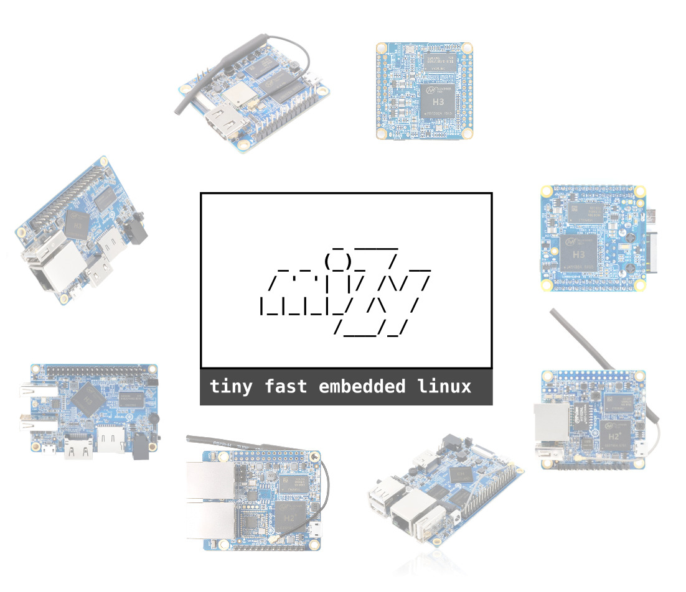
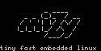

# [miZy - tiny fast embedded linux](https://hyphop.github.io/mizy/)

## Support Us - Donate

+ https://hyphop.github.io/donate/

## miZy -  tiny fast embedded linux 

+ https://hyphop.github.io/mizy/

## supported Boards

miZy special optimized for Allwinner H3 H2+ (SoC features a Quad-Core Cortex-A7 ARM CPU) boards

+ https://linux-sunxi.org/Category:H3_Boards
+ https://linux-sunxi.org/Category:H2%2B_Boards
+ https://linux-sunxi.org/H2%2B#Variants

## Frendly Arm boards

+ Frendly Arm - testing ... plz wait https://github.com/hyphop/miZy/wiki/friendly-arm

## Orange Pi boards

+ [Orange Pi Zero h2+](pages/orange-pi-zero) - TESTED OK
+ Orange Pi Zero Plus2 h3 - TESTED OK
+ Orange Pi Zero R1 - TESTED OK
+ Orange Pi One	- TESTED OK
+ Orange Pi PC	- TESTED OK
+ Orange Pi PC+ - 
+ Orange Pi Plus2E -
+ Orange Pi Lite - 
+ check more there http://www.orangepi.org/

## Other boards

+ and many other Allwinner H2+ H3 boards...

## Partial ( NAND InProgress ) (04/30/2019)

+ Sunvell H3 2GB RAM + 16GB ROM TV Box
+ Original M95 PRO Android TV Box Allwinner H3
+ Wechip R69 Allwinner H3 TV Box 
+ Smart TV Box CX-968/Allwinner H3
+ MXpro Android 7.1 tv box 1g 8g Allwinner H3 

**make request for test & support other boards** by email or via commit

## miZy main features

+ best for embedded or IOT usage (hi stable and tolerant for power off/lost and boot in any case again )
+ fast boot just 5-10sec
+ extreme tiny image size 8-16M
+ usable for SPI flash - 8M-16M (any another system not usable for spi flash)
+ loaded from any  FEL / SPI / mmc / sd  / usb sources / NET / ETH 
+ mizy is ALL IN RAM system + zero disk write mode ( write by user requst only ) flash friendly + maximum flash life time
+ diskless mode, ramfs + squashfs + overlay system ready 
+ optimized for low power usage 0.1A + low temp+ no need active cooling
+ easy fast firmware image builder + Development kit - make custom firmware just for several minutes
+ mizy suitable for any usage like IOT, audio, music, video, wireless, network, storage, automate  system, rescue, sunxi device test
+ high optimized legacy linux kernel + special mizy patches
+ fully sunxi soc hardware support : CPU freq i2s + SPDIF +DAC + ACD / SPI / i2c / HDMI CVBS / IR / USB OTG / SERIAL / MMC / SSD /  WIFI + ethernet ... 
+ advaced U-boot  + special mizy patches ( i2c display splash /  full read write SPI flash support, FEL mode, rescue mode.... )
+ compitable with OpenWrt trunk software repository
+ miZy is full open source project ( 1 year more active development )
+ many other features check it https://hyphop.github.io/mizy#news

## Plans! What to do next

+ next improve miZy code
+ write good wiki manuals docs and annotation
+ usage examples / more demo firmware  
+ prepare and open another miZy parts in public access as opensource
+ make bigger community - ( because now i'm only one + some users testers from hobbyist forums and sites )
+ make quality support
+ and many other

## lets Try 

some miZy firmware images in free access available for download

https://github.com/hyphop/miZy/releases

## Sources

some parts of miZy project already is opened for public usage: 

+ https://github.com/hyphop/miZy
+ https://github.com/hyphop/miZy-uboot
+ https://github.com/hyphop/miZy-linux-kernel
+ https://github.com/hyphop/miZy-spi-image-builder
+ https://github.com/hyphop/miZy-openwrt-sdk
+ https://github.com/hyphop/miZy-builder

## WiKi / Mans / Docs

+ https://github.com/hyphop/miZy/wiki

## Helper channel

+ https://hyphop.github.io/mizy/helper/

## LINKS

+ https://twitter.com/mizy_linux

# AUTHOR

[## hyphop ##](https://hyphop.github.io/)

