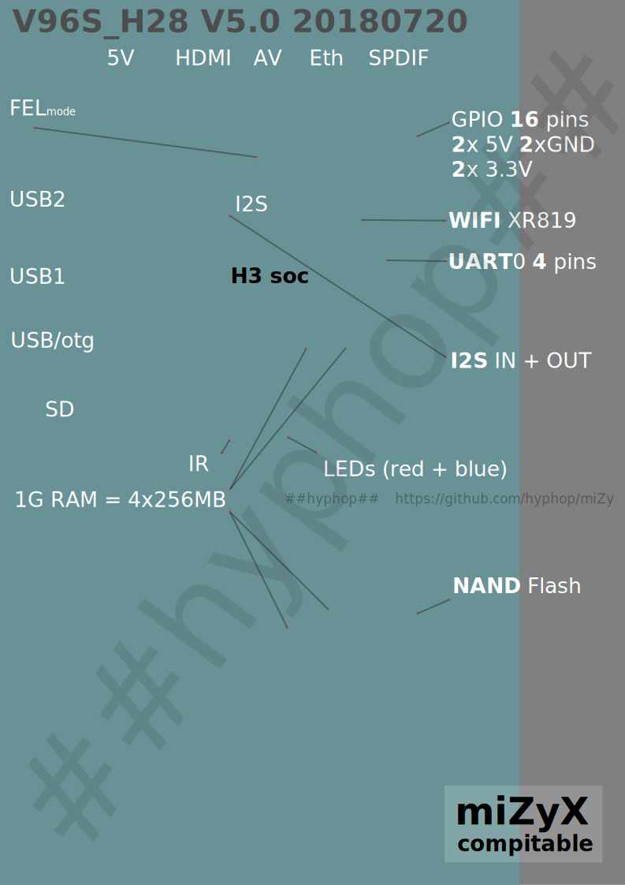

# MX3 h3 / V96S_H28 V5.0 20180720

Allwinner H3 (SoC features a Quad-Core Cortex-A7 ARM CPU)



```

RAM: 1G

3x USB (1 USB OTG)
SPDIF:	optical
HDMI:	1 (cable included)

FLASH: internal storage 8G NAND FLASH: sk hynix h27ucg8t2etr 


MMC: sd card

WIFI: XR819 2.4Ghz

power: 5V (adapter included)
AV: RCA CVBS AL AR x1
Ethernet : 100MB

LED: red / blue

I2S:	IN + OUT
GPIO:	16 free gpios + 2 x 5V + 2 x 3.3V + 2 GND
UART:	serial

IR: 31keys ( RC included )

CASE: plastic box 

board id: V96S_H28 V5.0 20180720


```

# MORE details

[i2s](i2s.md)
[gpio](gpio.md)

LINKS

+ https://github.com/hyphop/miZy
+ https://ru.aliexpress.com/item/SKhynix-TSOP-48-8GB-H27UCG8T2ETR-BC-H27UCG8T2ETR-BC-H27UCGBT2ETR-NEW-ORIGINAL-2PCS-LOT/32349899903.html
